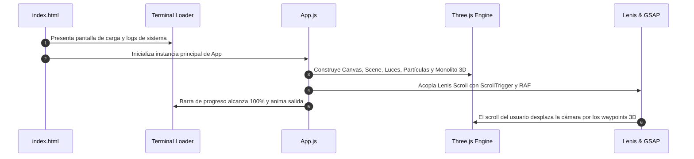

<div align="center">

  # ⚡ Interactive Portfolio

  <p align="center">
    <strong>Experiencia Web 3D Inmersiva de Alto Rendimiento // WebGL, Shaders & Motion Design</strong>
  </p>

  <p align="center">
    <a href="https://vitejs.dev/" target="_blank">
      
    </a>
    <a href="https://threejs.org/" target="_blank">
      
    </a>
    <a href="https://greensock.com/gsap/" target="_blank">
      
    </a>
    <a href="https://lenis.darkroom.engineering/" target="_blank">
      
    </a>
    <a href="https://developer.mozilla.org/es/docs/Web/JavaScript" target="_blank">
      
    </a>
  </p>

  <p align="center">
    
    
    
    
  </p>

  ---

  <p align="center">
    <i>Aplicación web interactiva de arquitectura desacoplada orientada al rendimiento gráfico, sincronización cinemática de scroll y microinteracciones de física en tiempo real.</i>
  </p>

</div>

<br />

## ✨ Experiencia actual

- **Showroom 3D continuo** con biomas visuales para frontend, Vue, Laravel, PostgreSQL y proyectos, incluido un corredor de cabinas de bases de datos completamente transitable.
- **Vitrinas tecnológicas generadas en tiempo real** para React, Vue, Laravel, Tailwind, PostgreSQL, Node.js, Socket.IO y Three.js.
- **Modo Explorador** con desplazamiento libre por teclado, mirada con ratón, colisiones y telemetría HUD; `Esc` devuelve al recorrido principal.
- **Tres perfiles gráficos persistentes**: Rendimiento, Ultra y Ultra+, con transición cinematográfica de pantalla completa al cambiar de modo.
- **Nebulosa volumétrica por raymarching** con ruido 3D, bruma azul medianoche, humo carbón, halos cian y una variante violeta de alta densidad en Ultra+.
- **Campo de partículas estable en coordenadas 3D**, con parallax de cámara sin estrellas que aparezcan o desaparezcan por reciclaje visual.
- **Ciudad de Sistemas en segundo plano** con ocho distritos temáticos, arquitectura procedural oscura, vías de datos, tránsito aéreo y densidad escalable sin invadir el corredor de las vitrinas.

---

## 📐 Arquitectura y Diseño de la Aplicación

La aplicación está construida sobre un ecosistema desacoplado que sincroniza de forma fluida tres capas principales:

```
┌────────────────────────────────────────────────────────────────────────┐
│                        CAPA 1: WebGL / 3D Canvas                       │
│  (Three.js Engine • Waypoints de Cámara 3D • Sistema de Partículas)   │
└───────────────────────────────────┬────────────────────────────────────┘
                                    │ Sincronización RAF / DeltaTime
┌───────────────────────────────────▼────────────────────────────────────┐
│                  CAPA 2: Pipeline de Scroll & Motion                   │
│   (Lenis Smooth Scroll • GSAP ScrollTrigger • Kinetic Scrubbing)       │
└───────────────────────────────────┬────────────────────────────────────┘
                                    │ Eventos Reactivos de Entrada
┌───────────────────────────────────▼────────────────────────────────────┐
│                    CAPA 3: Interfaz & Microfísica                      │
│ (Custom Cursor • 3D Tilt Cards • Magnetic Snapping • Web Audio Synth) │
└────────────────────────────────────────────────────────────────────────┘
```

---

## 🛠️ Componentes y Sistemas Técnicos

### 1. 🌌 Motor WebGL & Renderizado 3D (`src/three/`)
- **Escena & Waypoints Cinemáticos (`Engine.js` & `App.js`)**:
  - Traqueo de cámara en un espacio tridimensional continuo con 8 waypoints posicionales interpolados matemáticamente según el progreso global del scroll.
  - Mitigación activa de presión en el recolector de basura (*Garbage Collector*) mediante la reutilización de objetos de vectores scratch (`Vector3`) en el bucle de render.
- **Arquitectura ambiental (`scenes/EnvironmentBiomes.js` & `scenes/ColumnRuins.js`)**:
  - Torres, vitrinas y un corredor PostgreSQL con diez estaciones de trabajo 3D distribuidas por zonas sin ocultar la tecnología ni invadir el recorrido de cámara.
- **Ciudad procedural (`scenes/SystemsCity.js` & `textures/SystemsCitySignTextures.js`)**:
  - Skyline modular construido con instancias para ocho distritos: laboratorio, archivo de proyectos, red reactiva, fundición backend, operaciones de datos, fábrica de contenido y puerto de enlace.
  - Los edificios permanecen alejados en profundidad, usan masas casi negras y una iluminación cian/violeta contenida; Rendimiento, Ultra y Ultra+ activan capas progresivas de densidad, puentes locales, tránsito y drones.
- **Entidad morfológica (`scenes/MorphingCoreEntity.js`)**:
  - Núcleo procedural que transforma su geometría y enlaza visualmente los ecosistemas del recorrido mediante trayectorias espaciales controladas.
- **Partículas estratificadas (`effects/Particles.js`)**:
  - Campo profundo estable, capa bokeh y densidad violeta exclusiva de Ultra+, con interacciones temporales de gravedad e hipervelocidad.
- **Nebulosa y haces volumétricos (`effects/VolumetricNebula.js` & `effects/VolumetricLightBeams.js`)**:
  - Shader de fragmentos con raymarching, ruido Simplex 3D y deformación tipo curl, combinado con haces de luz adaptados al perfil gráfico.
- **Vitrinas generativas (`textures/TechnologyDisplayTextures.js`)**:
  - Texturas Canvas creadas en ejecución para presentar las arquitecturas y tecnologías principales sin depender de imágenes remotas.
- **Piso Infinito Reticular (`effects/GridFloor.js`)**:
  - Rejilla infinita en perspectiva con gradiente de niebla ambiental (*ambient fog vignette*) para sensación de profundidad sin límites.

---

### 2. ⚡ Pipeline de Animación & Scroll (`src/animations/` & `src/core/`)
- **Lenis Smooth Scroll Engine (`ScrollManager.js`)**:
  - Desplazamiento desacoplado del motor nativo del navegador para garantizar una tasa de cuadros estable y suave a 60 FPS.
- **Coreografía con GSAP & ScrollTrigger (`PortfolioOrchestrator.js`)**:
  - Anclaje espacial (*pinning*), revelación escalonada (*staggering*) y transiciones de paralaje sincronizadas con la trayectoria de la cámara 3D.
- **Perfiles gráficos (`GraphicsMode.js`)**:
  - Selector persistente Rendimiento / Ultra / Ultra+ que reconfigura resolución, niebla, partículas, raymarching, haces y densidad urbana con una transición GSAP de pantalla completa.
- **Vuelo libre (`ExplorerMode.js`)**:
  - Control alternativo de cámara con teclado y ratón, colisiones espaciales, soporte táctil y retorno seguro al recorrido narrativo.
- **Tipografía Cinética & Decodificación de Texto (`TextAnimations.js` & `TextInteractions.js`)**:
  - Efectos dinámicos de decodificación de caracteres (*hacker text scramble*), división de palabras/letras y revelación basada en visibilidad del viewport.

---

### 3. 🎯 Subsistemas de Interacción & Física (`src/core/`)
- **Cursor Dual con Inercia (`Cursor.js`)**:
  - Sistema de puntero compuesto por un punto central y un anillo elástico con amortiguación basada en resortes (*spring damping*), transformaciones dinámicas y estados reactivos al interactuar con botones o enlaces.
- **Física 3D en Tarjetas y Contenedores (`HoverTilt.js`)**:
  - Efecto de inclinación tridimensional reactivo al ratón utilizando transformaciones `rotateX`, `rotateY`, `perspective` y capas de brillo especular (*specular glare*).
- **Atracción Magnética (`MagneticManager.js`)**:
  - Atracción elástica del cursor sobre elementos interactivos clave al entrar en su radio de influencia.
- **Generador de Chispas en Clic (`ClickSparks.js`)**:
  - Lienzo 2D superpuesto que genera ráfagas de chispas físicas proyectadas en ángulos aleatorios tras cada interacción de clic.
- **Sintetizador Web Audio API (`SoundManager.js`)**:
  - Sistema de retroalimentación auditiva sintetizada algorítmicamente mediante nodos de oscilación y ganancia (`OscillatorNode`, `GainNode`), sin depender de archivos de audio externos pesados.

---

### 4. 🎨 Sistema de Diseño & Estilos (`src/styles/`)

La interfaz implementa un lenguaje visual **Cyber-Dark Minimalista** estructurado modularmente con variables nativas de CSS:

| Módulo de Estilo | Propósito y Responsabilidad |
| :--- | :--- |
| **`variables.css`** | Tokens de diseño centralizados: paleta HSL, tipografías (`Outfit`, `Playfair Display`, `JetBrains Mono`), espaciados y sombras de brillo (*glows*). |
| **`reset.css` & `base.css`** | Normalización de caja, configuración de renderizado tipográfico y estilos base. |
| **`layout.css`** | Cuadrículas fluidas (CSS Grid), contenedores adaptables y composición espacial. |
| **`components.css`** | Componentes modulares con efectos de desenfoque (*glassmorphism / backdrop-filter*), bordes sutiles y botones interactivos. |
| **`scenes.css`** | Capas atmosféricas, viñetas de niebla, terminal del loader y superposiciones cinemáticas. |
| **`explorer.css`** | HUD, controles táctiles y estados visuales del modo de exploración libre. |
| **`graphics-mode.css`** | Selector de calidad, transición de carga y variantes cromáticas de cada perfil. |
| **`animations.css`** | Keyframes para destellos, transiciones de estado, barras de carga y pulsos. |

---

### 5. 🌐 Motor de Internacionalización Runtime (`src/data/translations.js`)
- Sistema reactivo en el cliente que permite alternar instantáneamente entre múltiples idiomas sin recargar la página ni destruir el estado del motor WebGL o la posición de scroll.
- Vinculación declarativa en el DOM mediante atributos `data-i18n`.

---

## 📂 Estructura del Código Fuente

```bash
interactive-portfolio/
├── public/                 # Favicon, assets multimedia y recursos estáticos
├── src/
│   ├── animations/
│   │   └── TextAnimations.js        # Animaciones de tipografía y división de texto
│   ├── assets/                      # SVGs, iconos e imágenes del proyecto
│   ├── core/
│   │   ├── App.js                   # Orquestador principal e inicialización del ciclo de vida
│   │   ├── ClickSparks.js           # Renderizador de partículas al hacer clic
│   │   ├── Cursor.js                # Física y renderizado del cursor personalizado
│   │   ├── ExplorerMode.js          # Vuelo libre, colisiones, HUD y controles táctiles
│   │   ├── GraphicsMode.js          # Perfiles gráficos y transición de cambio
│   │   ├── HoverTilt.js             # Cálculos de perspectiva e inclinación 3D
│   │   ├── MagneticManager.js       # Atracción magnética de elementos interactivos
│   │   ├── PortfolioOrchestrator.js # Control central de animaciones GSAP & Scroll
│   │   ├── ScrollCounters.js        # Contadores numéricos interpolados
│   │   ├── ScrollManager.js         # Integración y sincronización de Lenis Scroll
│   │   ├── SoundManager.js          # Síntesis procedural de audio con Web Audio API
│   │   └── TextInteractions.js      # Decodificación y micro-interacciones de texto
│   ├── data/
│   │   ├── projects.js              # Estructura de datos de los proyectos
│   │   └── translations.js          # Diccionario y motor de traducción i18n
│   ├── styles/                      # Arquitectura CSS modular basada en tokens
│   ├── three/
│   │   ├── Engine.js                # Motor de escena, cámara, renderizador y loop RAF
│   │   ├── effects/
│   │   │   ├── GridFloor.js         # Rejilla infinita en perspectiva
│   │   │   ├── Particles.js         # Campo profundo y partículas interactivas
│   │   │   ├── VolumetricLightBeams.js # Haces atmosféricos por bioma
│   │   │   └── VolumetricNebula.js  # Raymarching y ruido volumétrico 3D
│   │   ├── scenes/
│   │   │   ├── ColumnRuins.js       # Construcción geométrica de torres y columnas
│   │   │   ├── EnvironmentBiomes.js # Zonas, vitrinas y distribución ambiental
│   │   │   ├── MorphingCoreEntity.js # Núcleo procedural y transformaciones
│   │   │   └── SystemsCity.js        # Ciudad distante, distritos y tránsito procedural
│   │   └── textures/
│   │       ├── SystemsCitySignTextures.js # Señalización Canvas de distritos
│   │       └── TechnologyDisplayTextures.js # Displays Canvas de tecnologías
│   └── main.js                      # Punto de entrada de la aplicación
├── index.html                       # Marcado semántico, loader y meta-etiquetas SEO
├── package.json                     # Declaración de dependencias y scripts
└── vite.config.js                   # Configuración del empaquetador Vite
```

---

## ⚙️ Flujo de Ejecución & Inicialización



---

## 🚀 Instalación y Entorno de Desarrollo

### Requisitos previos
- **Node.js** v18.0 o superior
- **npm** v9.0 o superior

### 1. Clonar el repositorio
```bash
git clone https://github.com/CANTARERO8/interactive-portfolio.git
cd interactive-portfolio
```

### 2. Instalar dependencias
```bash
npm install
```

### 3. Iniciar entorno de desarrollo
```bash
npm run dev
```
> Accede en el navegador a través de `http://localhost:5188/`.

### 4. Generar paquete de producción
```bash
npm run build
```
> Compila y optimiza todos los assets en el directorio `/dist` con compresión y tree-shaking.

---

<div align="center">
  <sub>Construido con Three.js, GSAP, Lenis y Vite. Licencia MIT.</sub>
</div>
